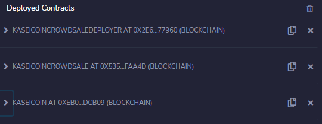

Module 21 - Challenge 21 : Fungible Token Crowdsale
==========================================

## Purpose

To create a fungible token that is ERC-20 compliant and that will be minted by using a Crowdsale contract from the OpenZeppelin Solidity library.

---

## Technologies

Remix IDE, metamask, Ganash, and the OpenZeppelin Solidity library were used in the creation of this project

---

## Installation Guide

Make sure to download Ganash prior to installing this project. Also make sure you have a metamask account and incorporate that into your browser. You;ll also need to use the Remix IDE - remix.ethereum.org

  1. Import KaseiCoin.sol and KaseiCoinCrowdsale.sol into the Remix IDE
  2. Compile KaseiCoin.sol and KaseiCoinCrowdsale.sol with the Remix IDE
  3. Load Ganache accounts into MetaMask
  4. Deploy KaseiCoinCrowdsaleDeployer using injected web3 and your MetaMask Accounts
 

---
## Validation

Deployment of the contract to a local blockchain with Remix, MetaMask, and Ganache

Using test accounts to buy new tokens from the crowdsale and then checking the balances associated with the test accounts.

After purchasing tokens with test accounts, viewing the total supply of minted tokens and the amount of wei that has been raised by the crowdsale.

---

## Contributors

Created by: Christopher Henderson

cdhendy@gmail.com

[LinkedIn](https://www.linkedin.com/in/chris-henderson123/)

---

## License

(c) Copyright 2021 Chris Henderson

Licensed under the MIT license:

    http://www.opensource.org/licenses/mit-license.php

Permission is hereby granted, free of charge, to any person obtaining a copy
of this software and associated documentation files (the "Software"), to deal
in the Software without restriction, including without limitation the rights
to use, copy, modify, merge, publish, distribute, sublicense, and/or sell
copies of the Software, and to permit persons to whom the Software is
furnished to do so, subject to the following conditions:
